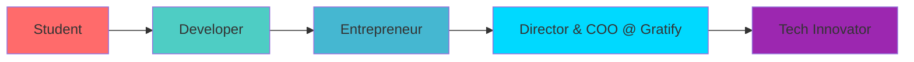

<div align="center">

# 👨‍💻 Krish Monga


<br>

[](https://portfolio-2u7v.vercel.app/)
[](https://www.linkedin.com/in/krish-monga-8b397a2a8)
[](mailto:krishmonga21667@gmail.com)
[](https://github.com/krishmonga)


</div>

## 🎯 About Me

```typescript
const krish = {
    role: "Director & COO @ Gratify Ventures",
    location: "India 🇮🇳",
    education: "Computer Science Student",
    passion: ["AI/ML", "IoT", "Full Stack Development"],
    mission: "Building tech that serves people & planet 🌍",
    currentFocus: ["Agentic AI", "Smart City Solutions", "Ethical AI"],
    funFact: "I turn coffee into code and ideas into reality ☕️→💡"
};
```

<div align="center">

### 🚀 **Tech Arsenal**


</div>

### 💻 Languages & Frameworks

<p align="center">
  
  
  
  
  
  
  
  
</p>

### 🤖 AI/ML & IoT

<p align="center">
  
  
  
  
  
  
</p>

### 🛠️ Tools & Platforms

<p align="center">
  
  
  
  
  
  
</p>

<br>

<div align="center">

</div>

## 🏆 Featured Projects

<table>
<tr>
<td width="50%">

### 🚌 [BNextBus](https://github.com/krishmonga/nextbus)
[](https://github.com/krishmonga/nextbus)

**Real-time bus tracking platform**

🔹 Live location sharing  
🔹 Smart scheduling & predictions  
🔹 Role-based dashboards  
🔹 Driver & passenger app  

**Stack:** React • Node.js • MongoDB • Maps API


</td>
<td width="50%">

### ♻️ [Trash2Treasure](https://github.com/GratifyPVT)
[](https://github.com/GratifyPVT)

**AI-powered Smart Dustbin**

🔹 Waste classification via ML  
🔹 Digital advertising display  
🔹 Reward system integration  
🔹 Analytics dashboard  

**Stack:** Raspberry Pi • OpenCV • Python • Cloud


</td>
</tr>
<tr>
<td width="50%">

### 🤖 [Cyberbullying Detection](https://github.com/krishmonga/cyberbullying-detection)
[](https://github.com/krishmonga/cyberbullying-detection)

**ML-powered content moderation**

🔹 47k+ tweets dataset  
🔹 Tri-View Hybrid Fusion  
🔹 DeBERTa + TF-IDF + PCA  
🔹 High accuracy classification  

**Stack:** Python • TensorFlow • NLP • Transformers


</td>
<td width="50%">

### 🧠 [AgentSync](https://github.com/krishmonga/AgentSync)
[](https://github.com/krishmonga/AgentSync)

**Agent management system**

🔹 JWT authentication  
🔹 CSV/XLSX parsing  
🔹 Automated task allocation  
🔹 Real-time dashboards  

**Stack:** MERN • JWT • File Processing


</td>
</tr>
</table>

<br>

<div align="center">

</div>

## 📊 GitHub Stats

<div align="center">


</div>

<br>

<div align="center">

</div>

## 🎖️ Achievements & Certifications

<p align="center">
  
  
  
  
</p>

<br>

## 🌱 Currently Exploring

<p align="center">
  
  
  
  
</p>

<br>

<div align="center">

</div>

## 💼 Professional Journey



<br>

## 📫 Let's Connect & Collaborate

<div align="center">

<a href="https://www.linkedin.com/in/krish-monga-8b397a2a8">
  
</a>
<a href="mailto:krishmonga21667@gmail.com">
  
</a>
<a href="https://github.com/krishmonga">
  
</a>
<a href="https://portfolio-2u7v.vercel.app/">
  
</a>

<br><br>


</div>

---

<br>

<div align="center">

### 👀 Profile Views


</div>

<br>
